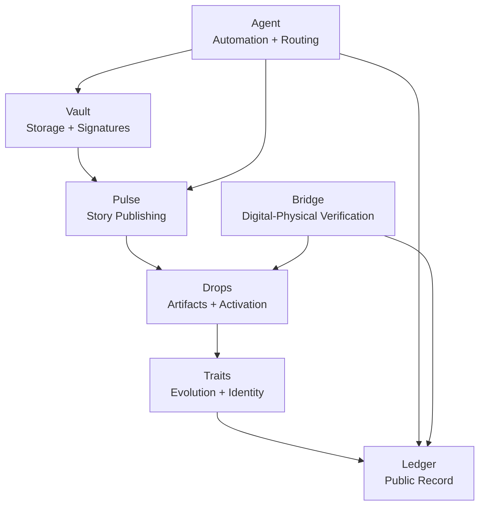

# Architecture

This page explains the XO architecture at a high level.

XO is built as a modular trust continuum rather than a single monolithic application. The system is designed so that different layers can evolve independently while still reinforcing one another.

## High-level flow

## Core modules

### Vault

Vault is the security and signing layer. It is responsible for storage, sealing, signatures, and trust anchors.

### Pulse

Pulse is the publishing and narrative layer. It turns activity into visible updates, stories, and public continuity.

### Drops

Drops are the activation layer. They package artifacts, experiences, and releases into forms people can actually receive, mint, or interact with.

### Traits

Traits are the evolution layer. They allow identities, collectibles, and artifacts to gain additional meaning or state over time.

### Ledger

Ledger is the public record layer. It preserves provenance, history, and verifiable continuity.

### Agent

Agent is the orchestration layer. It helps automate flows, route events, and coordinate the different parts of the system.

### Bridge

Bridge is the digital-physical layer. It connects objects, seals, QR or NFC references, and real-world verification back into the trust continuum.

## Design principle

Each XO module should be understandable on its own, but more powerful when linked to the others.