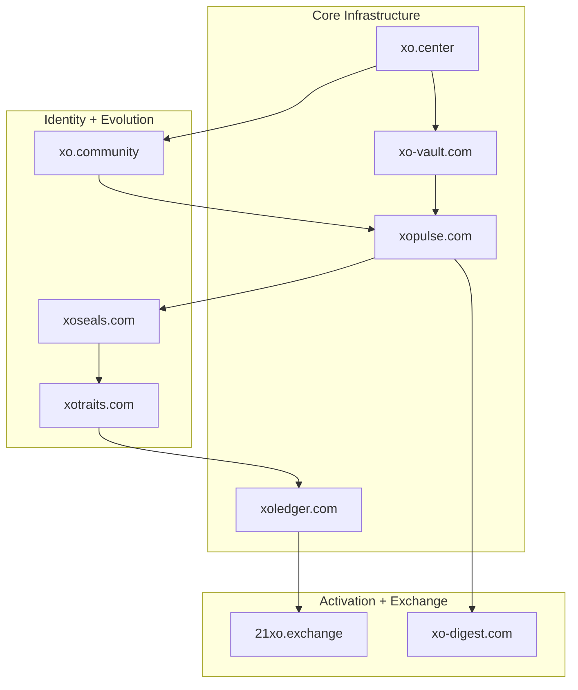

# XO Domain Constellation

The XO ecosystem is supported by a large constellation of domains. Each domain acts like a **planet or gateway** that exposes a specific part of the XO trust continuum.

Rather than one central platform, XO is intentionally distributed across multiple domains. This keeps the system modular, resilient, and easier to evolve over time.

!!! tip
    If you want to understand the **functional architecture behind these domains**, start with:

    - [XO Universe Map](xo-universe-map.md)

    That page explains how Vault, Pulse, Drops, Traits, and Ledger interact inside the trust continuum.

---

## Constellation Overview

Each node represents a **public entry point** into a module of the XO universe, while the grouped sections make it easier to distinguish the infrastructure, identity, and activation domains at a glance.

---

## Core Infrastructure Domains

These domains represent the foundational layers of the trust continuum.

| Domain | Role |
|--------|------|
| xo-vault.com | Secure sealing, signatures, and artifact storage |
| xopulse.com | Publishing signals, updates, and narrative streams |
| xoledger.com | Public verification layer and explorer |
| xo.center | Orientation hub for the ecosystem |

---

## Identity and Evolution

These domains support identity, lore, and digital evolution.

| Domain | Role |
|--------|------|
| xotraits.com | Trait system for evolving artifacts and avatars |
| xoseals.com | Authenticity markers and collectible seals |
| xo.community | Social layer and interaction hub |

---

## Activation Domains

These domains activate value and participation within the ecosystem.

| Domain | Role |
|--------|------|
| 21xo.exchange | Coordination and marketplace layer |
| xo-digest.com | Public summaries and daily ledger views |

---

## Why a Domain Constellation?

Most platforms concentrate everything into a single website.

XO instead distributes capabilities across domains because:

- systems become easier to evolve independently
- public trust improves when roles are clearly separated
- modules can scale without breaking the entire system
- experiments can launch without risking the core

This approach mirrors how the internet itself works — a **network of specialized nodes rather than a single monolith**.

---

## Long-Term Structure

Over time the constellation will expand with additional domains for:

- marketplaces
- identity layers
- games and lore
- community coordination
- physical-digital bridge systems

The goal is a **living universe of interconnected services** where each domain plays a clear role in the larger trust continuum.

---

## Status

Many XO domains are already registered and reserved as part of the long-term architecture.

The public constellation will gradually become visible as modules are stabilized and activated.
