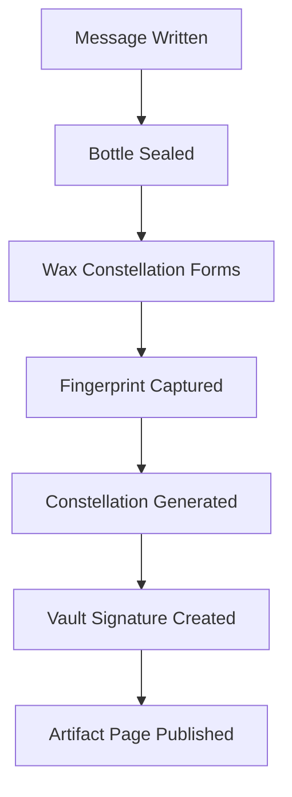

# Message Bottle

The **Message Bottle** is a physical–digital artifact in the XO ecosystem.  
Each bottle contains a written message, a unique physical seal, and a cryptographically signed record in XO Vault.

Every artifact is therefore:

```
object
+ message
+ fingerprint
+ vault signature
```

Together these elements create a verifiable story of origin.

---

# The Core Idea

A Message Bottle is inspired by the ancient act of sending a message into the unknown.

Instead of drifting across oceans, XO bottles travel across a **digital constellation** where every artifact has:

- a unique seal fingerprint
- a generated constellation map
- a signed Vault record

Collectors do not only receive an object — they receive a **traceable origin event**.

---

# What Makes Each Bottle Unique

Every bottle is sealed using wax mixed with metallic particles.  
When the wax cools, the particles settle into a completely random pattern.

This pattern becomes the artifact's **optical fingerprint**.

From this fingerprint we generate:

- a constellation map
- a unique artifact name
- a seed hash

Because the pattern forms randomly, it cannot be reproduced intentionally.

---

# Digital Twin

Each bottle is paired with a digital record stored in **XO Vault**.

Example record:

```yaml
artifact_uuid: xo-mb-0421
constellation: Lumen Harbor
seed_hash: 0x91af73
fingerprint_hash: 0xa77c92
```

The record is then signed by a Vault key:

```
vault_signature → proof of origin
```

This signature connects the physical bottle to the XO system.

---

# How Verification Works

Anyone can verify a bottle using a simple process:

1. Scan the QR marker on the bottle
2. Open the artifact page
3. Compare the seal fingerprint photo
4. Confirm the Vault signature

Verification stack:

```
physical fingerprint
+ artifact record
+ vault signature
+ public page
```

Even if someone visually copies the bottle, they cannot recreate the same fingerprint constellation.

---

# The First Drop

The first Message Bottle series contains:

```
777 bottles
```

They are released gradually so the constellation grows over time.

Structure:

```
21  Genesis Bottles
111 Early Constellation
555 Main Release
90  Reserve Bottles
```

Total:

```
777
```

This structure allows the system to evolve organically rather than appearing all at once.

---

# Why It Matters

Most digital collectibles start purely on-chain.

Message Bottles start with a **physical event**:

```
message written
→ bottle sealed
→ fingerprint formed
→ constellation generated
→ vault signature created
```

The result is an artifact with both:

- a physical origin
- a cryptographic proof

---

# Message Bottle Lifecycle

The lifecycle of a Message Bottle artifact follows a clear sequence from physical creation to digital verification.



This pipeline links the **physical creation event** to a **verifiable digital record** in the XO ecosystem.

---

# The Growing Constellation

Over time, every bottle becomes a star in a larger map.

Collectors can explore this constellation through the XO ecosystem, where each artifact contributes to a shared narrative.

The Message Bottle is therefore not just a collectible.

It is a **signal placed into the XO universe**.

