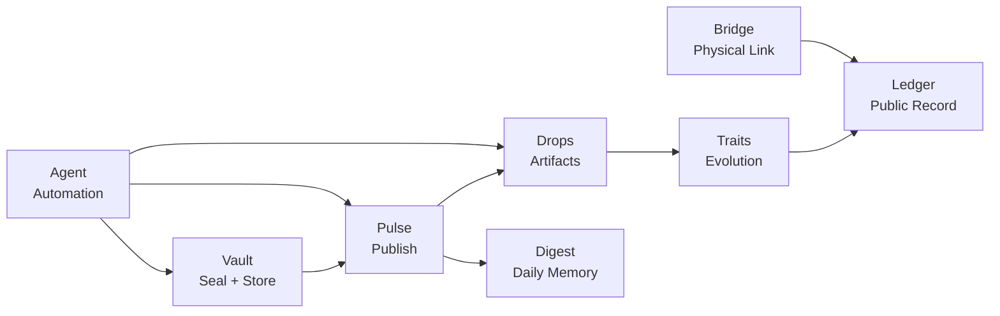

# XO Universe Map

This page provides a **visual overview of the XO ecosystem** and how its modules connect into a single trust continuum.

XO is not designed as a monolithic platform. Instead it is a **network of cooperating layers** where each component performs a clear role.

---

# The XO Trust Continuum

This diagram represents the **core lifecycle of an artifact inside the XO universe**.

---

# Lifecycle Example

A typical flow inside the system looks like this:

1. **Vault** seals an artifact or message
2. **Pulse** publishes the event
3. **Drops** distribute the artifact
4. **Traits** allow the artifact to evolve
5. **Ledger** records the permanent history
6. **Digest** summarizes activity
7. **Bridge** links the digital artifact to the physical world

Automation and orchestration are handled by the **Agent layer**.

---

# Why This Structure Exists

Most platforms combine everything into one application.

XO intentionally separates responsibilities because:

- each module can evolve independently
- systems remain easier to audit
- failures cannot break the entire ecosystem
- trust becomes verifiable instead of implied

This architecture forms what XO calls the **Trust Continuum**.

---

# Mental Model

You can think of XO as a **living universe of layers**:

| Layer | Role |
|------|------|
| Vault | Source of truth and signatures |
| Pulse | Communication layer |
| Drops | Distribution mechanism |
| Traits | Evolution and identity |
| Ledger | Immutable public memory |
| Digest | Human-readable summaries |
| Bridge | Connection to the physical world |
| Agent | Automation and coordination |

Each layer strengthens the others.

---

# Status

Most of these components already exist in **prototype or early operational form** across the XO repositories.

The current phase focuses on:

- stabilizing infrastructure
- clarifying documentation
- gradually activating public modules

Over time the map above will transform from an architectural diagram into a **fully active ecosystem**.